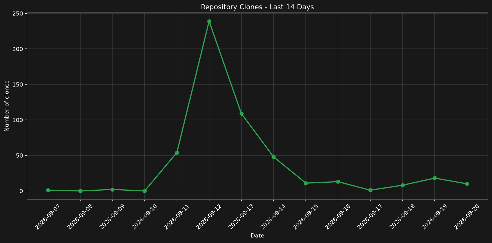
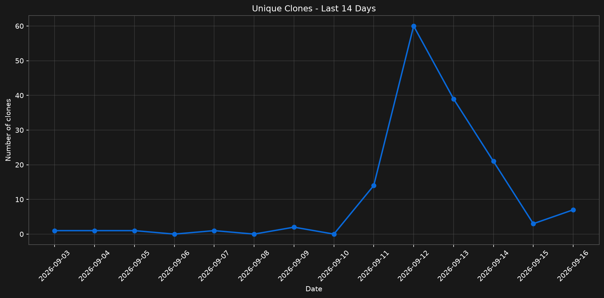

# 🛠️ AllTool-Linux

> A modular command-line toolkit for Linux bundling 20+ everyday utilities behind a single `alltool` command — files, media, networking, power, scripting, security, and more. Ships with an interactive installer (Debian, Arch, Fedora, openSUSE).

# Install

```sh
curl -fsSL https://raw.githubusercontent.com/Hajjani/AllTool-Linux/refs/heads/Stable/installer.sh | bash
```


# Growth of the project




[Get the full data](https://github.com/Hajjani/AllTool-Linux/pulse)

# Commands

| Command | Does what |
|---|---|
| `create` | Create a file (and parent folders) |
| `format` | Format a disk (ntfs, ext4, vfat) |
| `refresh` | Refresh setup, permissions, PATH |
| `help` / `search` | Show help (en, fr, ar, de) and spceified search |
| `sound` / `video` | Play audio / video |
| `netspeed` / `sif` / `sf` / `up` | Net speed, system info, list files, check updates |
| `power` | Power profiles + shutdown/reboot/sleep/lock |
| `run` | Auto-detect and run scripts (py, sh, js, rb, php, java, c/c++, …) |
| `psg` / `hs` | Generate passwords / hash files |
| `sr` / `wea` | Web search / weather |
| `pr` | Pomodoro timer |
| `upa` / `un` | Update / uninstall AllTool |
| `requirement` / `cl` | Check dependencies / clear terminal |
